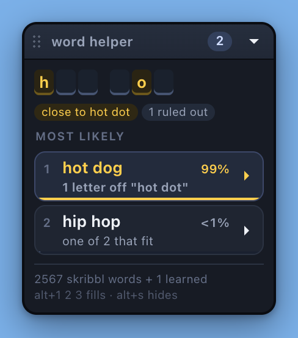

# skribbl word helper

A Chrome extension (Manifest V3) for [skribbl.io](https://skribbl.io) that reads
the hint row the game already shows you and tells you which words still fit —
live, as letters are revealed.



*Two letters revealed, another player's near miss called `close` by the server,
and the answer ranked at 99%. Rendered from the harness in `tools/`, which runs
the real extension against a reproduction of skribbl's DOM.*

The interesting part isn't the pattern matching. It's that **skribbl picks its
word uniformly at random**, so among the words that fit there is no "more
likely" — unless the round itself tells you more. It does, twice, and both
signals come out of the chat:

- **A guess you can read in chat is wrong**, by construction: when someone gets
  it right, the client replaces their message with a *"X guessed the word!"*
  line, so the word is never printed. Every readable guess is struck from the
  pool.
- **"X is close!"** is only sent for a near miss, so the answer is one or two
  letters from whatever that player just typed. Ranking by edit distance to it
  usually pins the word outright.

Both are detected from the inline `color: var(--COLOR_CHAT_TEXT_*)` that
skribbl's own client puts on every chat line — the CSS *variable name*, not the
text — so it works in every language the game ships. And when nothing tilts the
odds, the panel says `even odds, 1 in 12` instead of inventing a favourite.

Everything here is read from the DOM the game already renders. There is no
network traffic, no packet inspection, and no account involved.

### Fair play

This tells you the answer in a game whose entire point is guessing. It's a fun
thing to build and fine among friends who know you're running it. Using it on
strangers in a public lobby is the kind of thing people get kicked for. Your
call — but that's what it is.

## Install

1. Open `chrome://extensions`
2. Turn on **Developer mode** (top right)
3. **Load unpacked** → pick this folder
4. Open skribbl.io — the panel appears top-right

The panel renders inside a shadow root, so skribbl's stylesheet and the panel's
cannot reach into each other. `panel.css` is served to that shadow root through
`web_accessible_resources`.

## Using it

| | |
|---|---|
| **Letter tiles** | the hint, with a real gap between words; revealed letters in gold |
| **Badge** | how many words still fit — gold when only one does |
| **Pills** | what the panel knows: `close to hot dot`, `4 ruled out` |
| **Three picks** | always three to try, each with its odds and why |
| **Click a word** | puts it in the guess box; you press Enter |
| **Alt+1 / 2 / 3** | same, without reaching for the mouse |
| **▶ on a pick** | fills *and* sends it |
| **Type in the guess box** | narrows the list as you type — there is no second text field |
| **show the other N** | unfolds the full list of remaining candidates |
| **Alt+S** | fold to a one-line bar that still shows the lead word and the count |
| **Drag the header** | move it; the position is remembered |

A green-edged chip is a word learned from a reveal that isn't in the bundled list.

### Where it sits

208px wide and about 230px tall with three picks — the long tail of candidates is
folded behind **show the other N**, because that list was most of the height.

It places itself to stay off the drawing, checked against the page on every
repaint (so it settles correctly even if the game lays out late):

1. **Beside the board**, if the window is wider than the game — top-aligned with
   it, in whichever margin has room.
2. **Over the chat column** otherwise. skribbl's desktop grid is
   `"players canvas chat"` with a 300px chat, so a 208px panel fits inside it and
   the canvas stays completely visible. It sits at the top of that column, clear
   of the guess box.
3. **The top-right corner**, only if neither fits — on a window too narrow for
   the game itself. Alt+S folds it to a one-line bar there.

Drag it once and your position wins from then on.

### Always three to try

Guesses leave the running the moment they are spent, so the third slot refills
immediately and you always have three live options:

- a word **you** guess drops out on the keystroke, without waiting for the game
  to echo it back into chat;
- a word **anyone else** guesses drops out when their message appears.

So a wrong guess costs you a candidate, not your place in the list: `ace · ant ·
arm` becomes `ant · arm · ash` the instant you send `ace`.

### Sending is deliberately hard to do by accident

A stray click here types into a live game, and skribbl rate-limits chat
("Spam detected!"). So a send needs a real user gesture — `isTrusted`, which no
script or replayed event can fake — and is refused for a word already tried or
within 700 ms of the last one. Clicking a word only ever *fills* the box; nothing
reaches chat until you press Enter or hit the ▶.

## The top 3

Skribbl picks its word uniformly at random, so among the words that fit the
pattern there is no "more likely" — unless something in the round tells you more.
Two things do, and both come out of the chat:

**Wrong guesses are eliminated.** When someone guesses correctly, `game.js`
replaces their message with a *"X guessed the word!"* system line — the word
itself is never printed. So any guess you can actually read in chat is, by
construction, wrong. Every one of them is struck from the pool.

**"X is close!" is a near-miss.** The server only sends that for a very close
guess, so the answer is one or two letters from whatever that player just typed.
The panel finds their guess, and ranks the remaining candidates by edit distance
to it. In practice this usually pins the word outright.

Both are detected from the inline `color: var(--COLOR_CHAT_TEXT_BASE|CLOSE)` that
`Te()` puts on every chat line — the *variable name*, not the text, so it works in
every language skribbl ships. Messages coloured `GUESSCHAT` (players who already
guessed, talking among themselves) are deliberately ignored: those can contain the
real word, and treating one as a wrong guess would eliminate the answer.

On top of that, words seen in past reveals get a modest boost — they're known to be
in this room's list, and the count also reflects which words drawers pick.

Weights live at the top of `scored()` in `content.js`:

| evidence | weight | why |
|---|---|---|
| 1 letter from a "close" guess | ×40 | near-conclusive |
| 2 letters from it | ×6 | plausible |
| 3+ letters from it | ×0.15 | unlikely — but the exact server-side threshold is unknown, so it's down-weighted rather than excluded |
| seen in *n* past reveals | ×(1 + 0.6·min(n,5)) | definitely in this room's list |

**When there's no evidence the panel says so** rather than inventing a favourite:
the heading reads `even odds, 1 in 12`, and the percentages and confidence bars
are hidden entirely — three identical `<1%` labels would only dress up a coin
flip as a calculation.

Typing in the guess box filters which words are *shown*; it never moves a
percentage. What you type says nothing about what the drawer picked, so the odds
stay anchored to every word that fits.

See **Testing** below for how to exercise all of this without joining a game.

## Three tiers of words

skribbl picks from **its own fixed list**. Throwing a full dictionary into the
same pool would bury the real answer under 250,000 words the game would never
choose, so the tiers stay separate and ranked.

| tier | size | what it is | weight |
|---|---|---|---|
| **skribbl** | 2,567 | scraped from skribbl's own list, merged across three scrapes | 1.0 |
| **good** | 8,991 | common and drawable English skribbl doesn't use, in frequency order | 0.25 |
| **rest** | 257,755 | the remainder of the SOWPODS Scrabble dictionary | 0.02 |

**The dictionary tiers stay shut** while skribbl's own list explains the
pattern — a normal round is matched against 2,567 words and nothing else. They
open in two cases:

- **nothing on skribbl's list fits** the pattern, or
- **the room is using custom words**, which the panel detects when a round is
  revealed on a word skribbl's list has never contained. It then stays open for
  the rest of the session, and says so with a `custom words` pill.

Dictionary words are marked with a dashed border and always rank below skribbl's
own, so they fill the gaps without displacing the likely answer.

### Cost

`words-extra.json` is 2.9MB, so it is **not** bundled into the content script —
it's a web-accessible file fetched the first time a round actually needs it. A
normal round never loads it. Inside, each tier is bucketed by word length and
stored as one newline-joined string, so only the bucket for the current word
length is ever split into an array. Matching 12,255 five-letter dictionary words
takes 0.11 ms, measured in the browser.

Multi-word patterns skip the dictionary entirely — those tiers hold single words,
so `3 5` can only ever be a skribbl word or one learned from a reveal.

### What the dictionary can't do

SOWPODS contains no proper nouns, brands or memes — `minecraft`, `pikachu` and
`among us` are not in it, and those are exactly what custom rooms tend to use.
For those, the panel's own learning is the real fix: every reveal it sees gets
added to the pool permanently.

### It learns words

Every end-of-round reveal is recorded. Words not in the gist list get added to the
pool (green chips), so rooms with custom word lists start working after a round or
two. Words that have come up before sort to the front of the list. This lives in
`chrome.storage.local` — nothing leaves the browser.

### When it can't help

If the room has **word hidden** mode on, skribbl shows `? ? ?` instead of a real
pattern and there is nothing to match — the panel says so.

## How it works

From `skribbl.io/js/game.js`, the guesser's word row is built like this:

```js
for (a = 0; a < n; a++) hints[a] = $("hint", "_");     // n = letters + (words - 1)
container.appendChild($("word-length", lengths.join(" ")));   // e.g. "3 5"
```

So the extension reads:

- `#game-word .hints .container .hint` — one div per character, `_` until revealed,
  then the letter plus class `uncover`. **Spaces get a slot too.**
- `.word-length` — the per-word letter counts, which gives exact word boundaries.
  This is why `hot dog` matches a `3 3` pattern and `hotdog` doesn't.
- `#game-word .word` — only populated while *you're* drawing; the panel idles then.
- `#game-canvas .overlay-content .reveal .word` — the round reveal, used for learning.
- `#game-chat .chat-content p` — chat lines, for the evidence described above.

A word fits when its total length equals the slot count, its per-word lengths equal
`word-length`, and every revealed slot matches. Punctuation (`t-rex`, `AC/DC`,
`Mr. Bean`) needs no special casing — it occupies a slot like any other character.

## Testing

**`node tools/test-rank.js`** — pulls the real functions out of `content.js` (no
copy to drift) and checks elimination, close-attribution with interleaved speakers,
a German close line, the guess-chat safety case, the even-odds case, and the
distance maths. 10 assertions.

**`tools/harness.html`** — the whole extension running in a browser against a
reproduction of skribbl's DOM, built the way `pa()` / `ma()` / `Te()` build it in
`game.js`. It loads the real `words.js`, `content.js` and `panel.css`, with a
`chrome.storage.local` shim over `localStorage`. Buttons let you start a round,
reveal letters, have a player guess wrong, fire *"X is close!"*, post a guess-chat
line, switch on word-hidden mode, take the drawer's turn, and end the round.

Open it directly, or serve the folder if your browser blocks local subresources:

```bash
python3 -m http.server 8777
```

then visit `http://127.0.0.1:8777/tools/harness.html`. The panel behaves exactly as
it does on skribbl — the extension only ever reads the DOM, so a faithful DOM is a
faithful test.

## Rebuilding the word lists

```bash
python3 tools/build-words.py
```

Regenerates `words.js` and `words-extra.json`. The skribbl scrapes are committed
under `tools/sources/`; the big dictionaries are downloaded on first run and
cached in `/tmp/skribbl-helper-dicts`. Pass `--no-scrabble` to build without the
257k-word tier, which takes the package from 2.9MB to about 100KB.

Sources:

| file | source |
|---|---|
| `tools/sources/Skribbl-words.csv` | [mvark's gist](https://gist.github.com/mvark/9e0682c62d75625441f6ded366245203) |
| `tools/sources/skribbl-guesser.csv` | [jackkowalik/skribbl-guesser](https://github.com/jackkowalik/skribbl-guesser) — a newer scrape, +258 words |
| scribble.rs `en_us` + `en_gb` | [scribble-rs/scribble.rs](https://github.com/scribble-rs/scribble.rs) |
| google-10000-english | [first20hours/google-10000-english](https://github.com/first20hours/google-10000-english) |
| SOWPODS | [jesstess/Scrabble](https://github.com/jesstess/Scrabble) |

Word lengths are recomputed rather than trusted — the gist's own `count` column
disagrees with itself on two rows.

## Files

```
manifest.json          MV3 manifest, content script on https://skribbl.io/*
words.js               generated: skribbl's own list (bundled)
words-extra.json       generated: dictionary tiers (fetched on demand)
content.js             hint parsing, matching, panel
panel.css              panel styles, loaded into the shadow root
tools/build-words.py   sources -> words.js + words-extra.json
tools/sources/         committed skribbl word-list scrapes
tools/test-rank.js     tests the ranking against the real content.js
tools/harness.html     the extension running against a replica of skribbl's DOM
                       and its real desktop grid, for checking placement
```

## Credits

The word lists are other people's work. None of them are vendored wholesale —
`tools/build-words.py` merges, de-duplicates and re-tiers them — but the data
originates here:

| source | used for | licence |
|---|---|---|
| [mvark's gist](https://gist.github.com/mvark/9e0682c62d75625441f6ded366245203) | skribbl word list | no licence stated |
| [jackkowalik/skribbl-guesser](https://github.com/jackkowalik/skribbl-guesser) | a newer scrape, +258 words | MIT |
| [scribble-rs/scribble.rs](https://github.com/scribble-rs/scribble.rs) | drawable English (`good` tier) | BSD-3-Clause |
| [first20hours/google-10000-english](https://github.com/first20hours/google-10000-english) | frequency ordering (`good` tier) | see note below |
| [jesstess/Scrabble](https://github.com/jesstess/Scrabble) | SOWPODS (`rest` tier) | MIT |

Two caveats worth knowing if you fork this:

- **google-10000-english** derives from the Google Web Trillion Word Corpus via
  the LDC. Its licence permits educational and personal use and explicitly
  advises against commercial use without an LDC licence.
- **SOWPODS** is distributed under an MIT-licensed repository, but the
  underlying word list is a commercial dictionary in some jurisdictions. If that
  matters to you, `python3 tools/build-words.py --no-scrabble` builds without it
  and drops the package from 2.9MB to about 100KB.

The skribbl word lists are factual compilations of skribbl.io's own data, not
the work of whoever scraped them. They are credited above on that basis.

skribbl.io is a game by Ticedev. This project is not affiliated with it in any
way, and does not modify, proxy or interfere with the game — it only reads the
page.

## Licence

[MIT](LICENSE) © Vishal Meena
