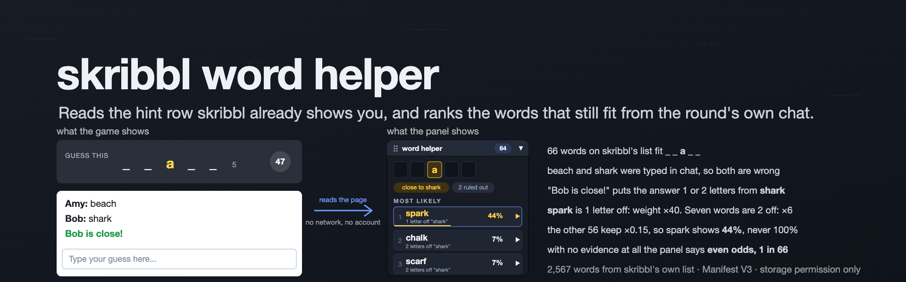
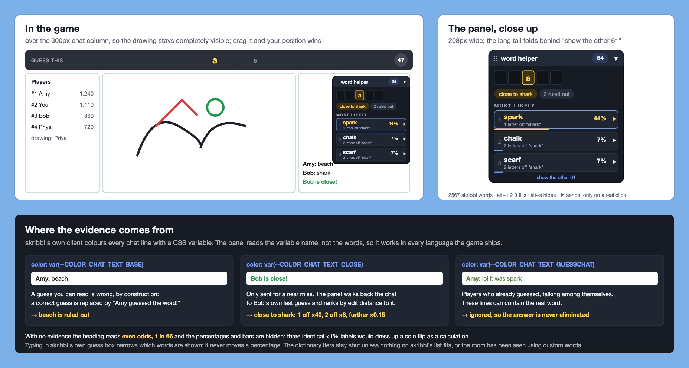
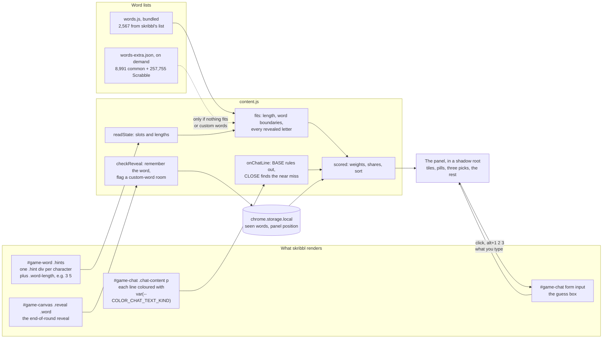

<div align="center">



<br>

**A Chrome extension for [skribbl.io](https://skribbl.io) that reads the hint row the game already shows you<br>and ranks the words that still fit, using the round's own chat as evidence. Nothing leaves the browser.**

<br>

[](#run-it-on-your-machine)
[](#how-it-works)
[](#run-it-on-your-machine)
[](#the-rules-it-keeps)
<br>
[](#run-it-on-your-machine)
[](#how-it-works)
[](#how-far-to-trust-it)
[](#licence)

[What it does](#what-it-does) · [The rules it keeps](#the-rules-it-keeps) · [How far to trust it](#how-far-to-trust-it) · [How it works](#how-it-works) · [Run it yourself](#run-it-on-your-machine) · [Credits](#credits)

</div>

<br>

<p align="center">
  
</p>

## Why this exists

Playing skribbl, the game shows you a row of blanks and reveals a letter now and then as the timer runs down. Working out which words fit is easy. The interesting part is what comes next.

**skribbl picks its word uniformly at random.** Among the words that fit the pattern there is no "more likely", unless the round itself tells you more. It does, twice, and both signals are already in the chat:

- **A guess you can read in chat is wrong**, by construction. When someone gets it right, the client replaces their message with a *"X guessed the word!"* line, so the word is never printed. Every readable guess is struck from the pool.
- **"X is close!"** is only sent for a near miss, so the answer is one or two letters from whatever that player just typed. Ranking the remaining words by edit distance to that guess usually pins the word outright.

Both are detected from the colour skribbl's own client puts on every chat line, `color: var(--COLOR_CHAT_TEXT_BASE)` or `..._CLOSE`. It is the variable *name* that is read, not the text, so it works in every language the game ships. When nothing tilts the odds, the panel says `even odds, 1 in 12` instead of inventing a favourite.

Everything is read from the page the game already renders. There is no network traffic, no packet inspection, and no account.

## What it does

| | |
|---|---|
| **Letter tiles** | The hint drawn as tiles, with a real gap between words. Revealed letters in gold. |
| **A count** | How many words still fit. Gold when only one does. |
| **Pills** | What the panel knows this round: `close to shark`, `2 ruled out`, `custom words`. |
| **Three picks, always** | Each with its odds and the reason. A word anyone guesses leaves the list the moment it is spent, so the third slot refills at once: `ace · ant · arm` becomes `ant · arm · ash` the instant you send `ace`. |
| **Click, or Alt+1, 2, 3** | Puts the word in skribbl's guess box. You press Enter. |
| **The ▶ on a pick** | Fills the box *and* sends it. So does a double click. |
| **Type in the guess box** | Narrows the list as you type. There is no second text field. If what you type matches nothing, it is ordinary chat and the filter steps aside. |
| **show the other N** | Unfolds the full list of remaining words, up to 300 chips. |
| **Alt+S** | Folds the panel to a one-line bar that still shows the lead word and the count. |
| **Drag the header** | Moves it. The position is remembered. |
| **Learns words** | Every end-of-round reveal is recorded. A revealed word that is not on skribbl's list is added to the pool, shown as a green-edged chip, and the room is marked as using custom words. |
| **A dictionary, when needed** | Two extra tiers, 8,991 common words and 257,755 Scrabble words, open only when nothing on skribbl's list fits or the room is using custom words. Fetched on demand, never in a normal round. |

<p align="center">
  
</p>

*Rendered from the harness in `tools/`, which runs the real extension against a reproduction of skribbl's DOM.*

**Where it sits.** The panel is 208px wide. Until you drag it, it places itself to stay off the drawing, checked on every repaint so it settles correctly even if the game lays out late: beside the board if the window is wider than the game; otherwise over the chat column, which is 300px wide on skribbl's desktop grid, so the canvas stays completely visible; and only on a window too narrow for the game itself does it fall back to the top-right corner.

## The rules it keeps

- **It only reads the page.** Nothing is sent anywhere. The one request it makes is for its own `words-extra.json`, a file inside the extension package, and only when a round needs it.
- **It stores two things**, in `chrome.storage.local`: the words it has seen revealed, and the panel's position and folded state.
- **What you type never moves a percentage.** Typing filters which words are shown. It says nothing about what the drawer picked, so the odds stay anchored to every word that fits.
- **It never shows 100% while more than one word fits.** The threshold the server uses for "close" is unknown, so a 3-letter miss is down-weighted, not excluded, and the top pick is capped at 99%.
- **No evidence means even odds.** The heading reads `even odds, 1 in 12` and the percentages and bars are hidden. Three identical `<1%` labels would dress up a coin flip as a calculation.
- **Lines from players who have already guessed are ignored.** They are coloured `GUESSCHAT` and can contain the real word. Treating one as a wrong guess would eliminate the answer.
- **The dictionary never outranks skribbl's list.** Dictionary words carry a dashed border and a weight of 0.25 or 0.02 against 1.0, so they fill gaps without displacing the likely answer. A multi-word pattern skips them entirely, because those tiers hold single words.
- **Sending is hard to do by accident.** A stray click here types into a live game, and skribbl rate-limits chat. So a send needs a real user gesture (`isTrusted`, which no script can fake), is refused for a word already tried this round, and is refused within 700 ms of the last one. A plain click only ever fills the box.
- **Fair play is your call.** This tells you the answer in a game whose whole point is guessing. It is a fun thing to build, and fine among friends who know you are running it. Using it on strangers in a public lobby is the kind of thing people get kicked for.

## How far to trust it

> [!IMPORTANT]
> **The word list is a scrape, and the DOM is someone else's.** The 2,567 words come from two public scrapes of skribbl's list merged together; skribbl can change its list without notice, and anything it adds will show up only once the panel has seen it revealed. Everything the panel reads depends on the markup and the CSS variable names in `skribbl.io/js/game.js`, which can change any day. The exact server-side threshold for "close" is unknown, so the ×40, ×6 and ×0.15 weights are a judgement, not a measurement.

What was checked: `node tools/test-rank.js` runs 16 checks against the real functions in `content.js`, covering elimination, close-attribution with interleaved speakers, a translated close line, the guess-chat safety case, the even-odds case, the seen-count prior, immediate drop-out of your own guess, the dictionary gates, and the distance maths. The harness in `tools/harness.html` drives the whole extension against a reproduction of skribbl's DOM and grid. It is not on the Chrome Web Store; you load it unpacked.

## How it works



From `game.js`, the guesser's word row is one `div.hint` per character, `_` until revealed, then the letter with class `uncover`, and a trailing `.word-length` such as `3 5`. Spaces get a slot too. A word fits when its total length equals the slot count, its per-word lengths equal `.word-length`, and every revealed slot matches. That is why `hot dog` matches a `3 3` pattern and `hotdog` does not. Punctuation needs no special case: `t-rex`, `AC/DC` and `Mr. Bean` occupy slots like any other character. In "word hidden" mode the slots read `?` and the panel says there is nothing to match.

**The weights**, at the top of `scored()` in `content.js`:

| Evidence | Weight | Why |
|---|---|---|
| 1 letter from a "close" guess | ×40 | near-conclusive |
| 2 letters from it | ×6 | plausible |
| 3 or more letters from it | ×0.15 | unlikely, but the server's threshold is unknown, so down-weighted rather than excluded |
| Seen in *n* past reveals | ×(1 + 0.6 × min(n, 5)) | definitely in this room's list, and drawers' habits show in the count |
| A `good` dictionary word | ×0.25, decaying with frequency rank | common or drawable English skribbl does not use |
| A `rest` dictionary word | ×0.02, decaying with position | the remainder of the Scrabble dictionary |

**The three tiers.** skribbl picks from its own fixed list. A full dictionary in the same pool would bury the real answer under words the game would never choose, so the tiers stay separate.

| Tier | Size | What it is | Where |
|---|---|---|---|
| **skribbl** | 2,567 | skribbl's own list, merged from two scrapes | `words.js`, bundled |
| **good** | 8,991 | common and drawable English skribbl does not use, in frequency order | `words-extra.json`, fetched on demand |
| **rest** | 257,755 | the remainder of the SOWPODS Scrabble dictionary | `words-extra.json`, fetched on demand |

`words-extra.json` is 2.9 MB, so it is not bundled into the content script. Inside, each tier is bucketed by word length and stored as one newline-joined string, so only the bucket for the current length is ever split into an array. SOWPODS holds no proper nouns, brands or memes, which is exactly what custom rooms use; for those, the panel's own learning is the real fix.

| Part | What it is |
|---|---|
| [`manifest.json`](manifest.json) | Manifest V3. One permission, `storage`. Content script on `https://skribbl.io/*` only |
| [`content.js`](content.js) | Reading the game, matching, the chat evidence, learning, the panel and its placement. The DOM contract is documented at the top |
| [`panel.css`](panel.css) | The panel's styles, loaded into its shadow root so skribbl's stylesheet and this one cannot reach into each other |
| [`words.js`](words.js), [`words-extra.json`](words-extra.json) | Generated by `tools/build-words.py`. Do not edit by hand |
| [`tools/build-words.py`](tools/build-words.py) | Merges the sources into the three tiers. Word lengths are recomputed rather than trusted, because one source's own count column disagrees with itself on two rows |
| [`tools/test-rank.js`](tools/test-rank.js) | Pulls the real functions out of `content.js`, so the tests cannot drift from the code |
| [`tools/harness.html`](tools/harness.html) | The extension running against a replica of skribbl's DOM and desktop grid, built the way `pa()`, `ma()` and `Te()` build it in `game.js` |
| [`tools/debug-snippet.js`](tools/debug-snippet.js) | Paste into the DevTools console on skribbl.io to print what the panel can see. Read-only |
| [`docs/STORE-LISTING.md`](docs/STORE-LISTING.md) | Chrome Web Store copy, permission justifications and privacy declarations, ready to paste |

## Run it on your machine

You need Chrome, or another browser that loads Manifest V3 extensions unpacked. Node.js runs the tests and Python 3 rebuilds the word lists; neither is needed to play.

```bash
git clone https://github.com/vishalmeena2211/skribbl-word-helper.git
```

Then, in Chrome:

1. Open `chrome://extensions`
2. Turn on **Developer mode**, top right
3. **Load unpacked** and pick the folder you just cloned
4. Open skribbl.io. The panel appears beside the board or over the chat column.

To run the ranking tests:

```bash
node tools/test-rank.js
```

To drive the whole extension without joining a game, serve the folder (the panel fetches its stylesheet, so opening the file directly may be blocked):

```bash
python3 -m http.server 8777
```

and open http://127.0.0.1:8777/tools/harness.html. Buttons start a round, reveal letters, have a player guess wrong, fire *"X is close!"*, post a guess-chat line, switch on word-hidden mode, take the drawer's turn and end the round.

To rebuild the word lists after changing `tools/build-words.py` or the files in `tools/sources/`:

```bash
python3 tools/build-words.py
```

The two skribbl scrapes are committed; the big dictionaries are downloaded on first run and cached in `/tmp/skribbl-helper-dicts`. To build without the 257,755-word Scrabble tier, which takes `words-extra.json` from 2.9 MB to about 80 KB:

```bash
python3 tools/build-words.py --no-scrabble
```

To package it for the Chrome Web Store, if you decide to publish (read [`docs/STORE-LISTING.md`](docs/STORE-LISTING.md) first; skribbl's own report dialog lists "Botting / Cheating", so a listing can be rejected or removed later):

```bash
zip -r skribbl-word-helper-1.3.0.zip manifest.json content.js panel.css words.js words-extra.json icons LICENSE
```

## Repository layout

| Path | What is in it |
|---|---|
| [`manifest.json`](manifest.json), [`content.js`](content.js), [`panel.css`](panel.css) | The extension |
| [`words.js`](words.js), [`words-extra.json`](words-extra.json) | The generated word lists: skribbl's own, bundled; the dictionary tiers, fetched on demand |
| [`icons/`](icons) | The extension icons at 16, 32, 48 and 128px |
| [`tools/`](tools) | The word-list builder and its committed skribbl scrapes in `sources/`, the tests, the harness, and the debug snippet |
| [`docs/`](docs) | The panel screenshot, the 1280×800 store screenshot, and the store listing copy |

## Roadmap

- [x] Match the hint row, with exact word boundaries from `.word-length`
- [x] Eliminate readable guesses; rank by edit distance to a "close" guess; ignore guess-chat
- [x] Even odds, stated plainly, when nothing tilts them
- [x] Three picks that refill the instant a guess is spent; Alt+1, 2, 3 and Alt+S
- [x] Placement that stays off the drawing; drag to override
- [x] Learn words from reveals; detect custom-word rooms; dictionary tiers on demand
- [x] Tests against the real `content.js`, and a DOM harness
- [x] Chrome Web Store copy, icons and screenshot prepared
- [ ] Decide whether to publish on the Web Store, or keep it load-unpacked only
- [ ] Make `tools/test-rank.js` read `content.js` relative to the repository rather than from a fixed path
- [ ] A fresh scrape of skribbl's word list, to catch words added since the two sources were made

## Contributing

**If you play:** the most useful thing you can do is notice a round where the panel was wrong, run [`tools/debug-snippet.js`](tools/debug-snippet.js) in the DevTools console, and open an issue with what it printed.

**If you write code:** read [`CONTRIBUTING.md`](CONTRIBUTING.md) first. Before a pull request, `node tools/test-rank.js` must be all green and `node --check content.js` must pass. UI changes are checked in the harness. If skribbl changes its markup, re-derive the DOM contract from the game's own client (`curl -s https://skribbl.io/js/game.js`) and look at `pa()`, `ma()` and `Te()`, rather than guessing. Never edit `words.js` or `words-extra.json` by hand; change the builder or the sources and regenerate. Keep the tiers honest: `words.js` is for words skribbl actually uses.

## Credits

The word lists are other people's work. None are vendored wholesale; `tools/build-words.py` merges, de-duplicates and re-tiers them. The data originates here:

| Source | Used for | Licence |
|---|---|---|
| [mvark's gist](https://gist.github.com/mvark/9e0682c62d75625441f6ded366245203) | skribbl word list | no licence stated |
| [jackkowalik/skribbl-guesser](https://github.com/jackkowalik/skribbl-guesser) | a newer scrape of the same list, +258 words | MIT |
| [scribble-rs/scribble.rs](https://github.com/scribble-rs/scribble.rs) | drawable English, the `good` tier | BSD-3-Clause |
| [first20hours/google-10000-english](https://github.com/first20hours/google-10000-english) | frequency ordering of the `good` tier | see below |
| [jesstess/Scrabble](https://github.com/jesstess/Scrabble) | SOWPODS, the `rest` tier | MIT |

Two caveats if you fork this. **google-10000-english** derives from the Google Web Trillion Word Corpus via the LDC; its licence permits educational and personal use and advises against commercial use without an LDC licence. **SOWPODS** is distributed from an MIT-licensed repository, but the underlying word list is a commercial dictionary in some jurisdictions. If that matters to you, build with `--no-scrabble`.

The skribbl word lists are factual compilations of skribbl.io's own data, not the work of whoever scraped them, and are credited above on that basis.

skribbl.io is a game by Ticedev. This project is not affiliated with it in any way, and does not modify, proxy or interfere with the game. It only reads the page.

## Licence

**[MIT](LICENSE)**, © Vishal Meena. Use it, change it and share it, keeping the copyright notice. The word lists keep the licences of their sources, listed above.

## Words used here

| Word | What it means |
|---|---|
| **Hint row** | The row of blanks skribbl shows a guesser, one slot per character, with letters revealed over time |
| **Slot** | One character position in the hint. A space between words gets a slot too |
| **Fits** | A word of the right total length, the right per-word lengths, and the right letter in every revealed slot |
| **Ruled out** | A word someone typed in chat this round, or one you sent yourself. A readable guess is always wrong |
| **Close** | skribbl's "X is close!" line, sent only for a near miss. The panel ranks by edit distance to that player's last guess |
| **Guess-chat** | Chat from players who have already guessed, coloured `GUESSCHAT`. Ignored, because it can contain the answer |
| **Learned word** | A word seen in an end-of-round reveal that is not on skribbl's list. Shown with a green edge |
| **Custom room** | A room where a revealed word was not on skribbl's list. The dictionary tiers stay open for the rest of the session |
| **Tier** | One of the three word lists: skribbl, good, rest. They never mix on equal terms |
| **Harness** | `tools/harness.html`: the real extension running against a copy of skribbl's DOM, so it can be tested without a game |

<br>

<div align="center">
<sub>It only reads the page. Among friends who know you are running it.</sub>
</div>
